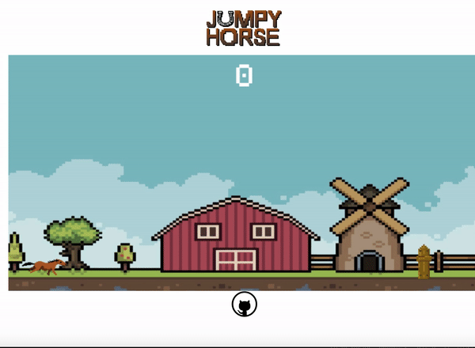
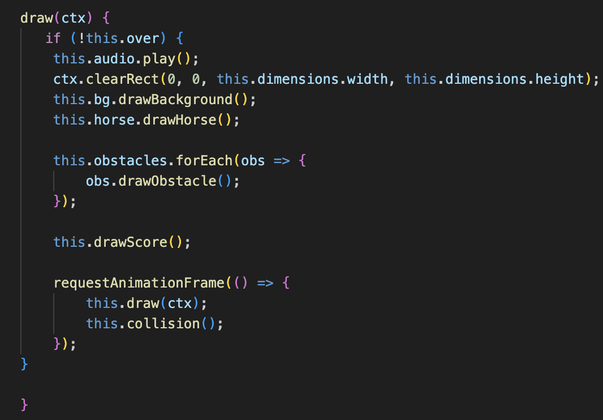
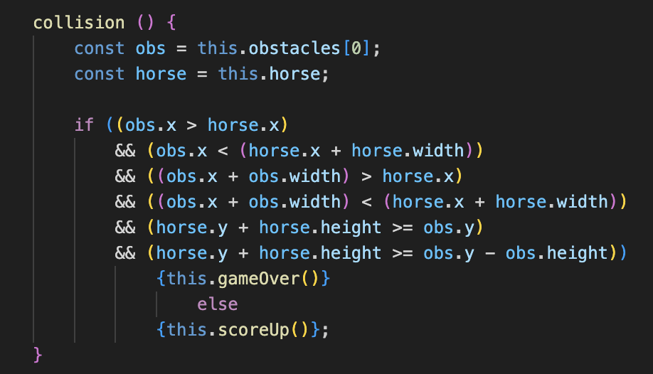
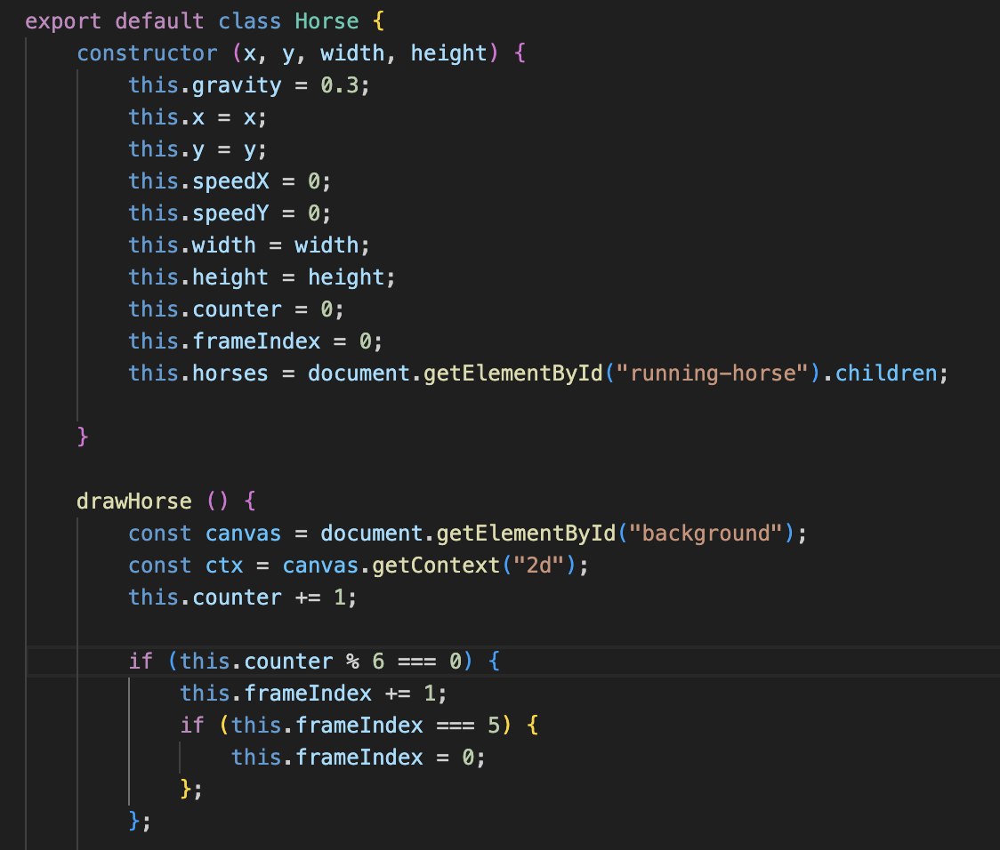

# JumpyHorse

<a href= "https://vczaran.github.io/JumpyHorse/">Jumpy Horse</a> is an 8bit, retro style game in which the user navigates an equine avatar over obstacles. Colliding with an obstacle will end the game. Jumping is accomplished by pressing the spacebar. Start modal includes game instructions and start button that begins the game. End modal pops up upon collision and includes a button to restart the game. Galloping sound effects play during the game and end on game over. 

# Functionality 

* Canvas drawing and movement of obstacles, background, and horse sprite is accomplished by compiling all individual draw functions from the different classes into one universal draw function to ensure all Canvas elements are drawn simultaneously every frame.

* Obstacles are created and immediately stored in an array on loop and shifted from the array when going off screen, thus only one obstacle is within the array at a time. Collision detection is therefore used to check for collisions between the first element in the obstacles array and the horse sprite by checking if the range of x and y coordinates of either object overlaps. Game over function is called when a collision is detected. If no collision is detected, the score increments. 

* Horse sprite animation is achieved by cycling through 5 different images of the same size every 6 frames. The drawHorse function is called every frame, hence the counter attribute will increment with every frame. Horse sprite images are stored in an HTML div tag and accessed by accessing the children of that tag.

# Technologies, Libraries, APIs

Canvas API

HTML

CSS

Webpack and Babel

npm

**Implementation Timeline:**

Friday & Weekend: Get Canvas set up and rendering background and horse object. Research how to animate background and horse with Canvas. If possible, begin to animate background and horse.

Monday: Get horse running and background moving if not done already. Start adding obstacles and researching collision logic and handling.

Tuesday: Add gravity functionality and jump controls. Finalize collision handling.

Wednesday: Add styling and music/sound effects.

Thursday Morning: Final touches, update ReadME.

**Bonus Features:**

Change in environment every 25 jumps - background, music, and obstacles will change accordingly. Default initial style will be a farm and will transition to spooky forest then city and finally beach. 

Horse styles willl be unlockable based on game progress - each will have different stats (such as increased jump height and/or speed). The final unlock, upon completion of the game, will be a pegasus that can fly over obstacles.
